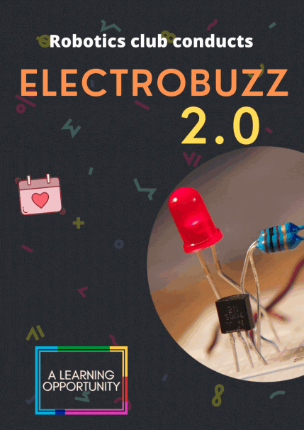

# Event Poster

# Recording

The Event
Those who want to revise or have missed some part in the workshop can refer to the recording click [here](https://drive.google.com/file/d/1iTFUaBLwCBlMiBx_x47uNd5uwAb6RoI4/view?usp=sharing)

# Practicals

Find all the practicals shown in the workshop [here](https://www.tinkercad.com/things/84D9l26DGhN-amazing-fyyran-migelo/editel?sharecode=XP_oHDh-LCCfJ2-Jjll-lzqC0Stnz50JKi5iDUGFDkY) 

# Tasks

The students Were asked to make Tasks in the workshop solutions to them are below:

- ### Task - 1 : [Brightness control using  any sensor.](https://www.tinkercad.com/things/hy1MN3ZhfSS-sizzling-sango/editel?sharecode=kYFUqSmNZ_4_nftAWM8Pm0lNYf70Gz89TJb7nywHf1Y)

- ### Task - 2 : [control the speed of motor using hand gestures.](https://www.tinkercad.com/things/k0LMbFM6Dqr-spectacular-bombul/editel?sharecode=vsk_iEDHfjVAtf9YElPB1HqPm6KOHsDkb588KZYKN68)

