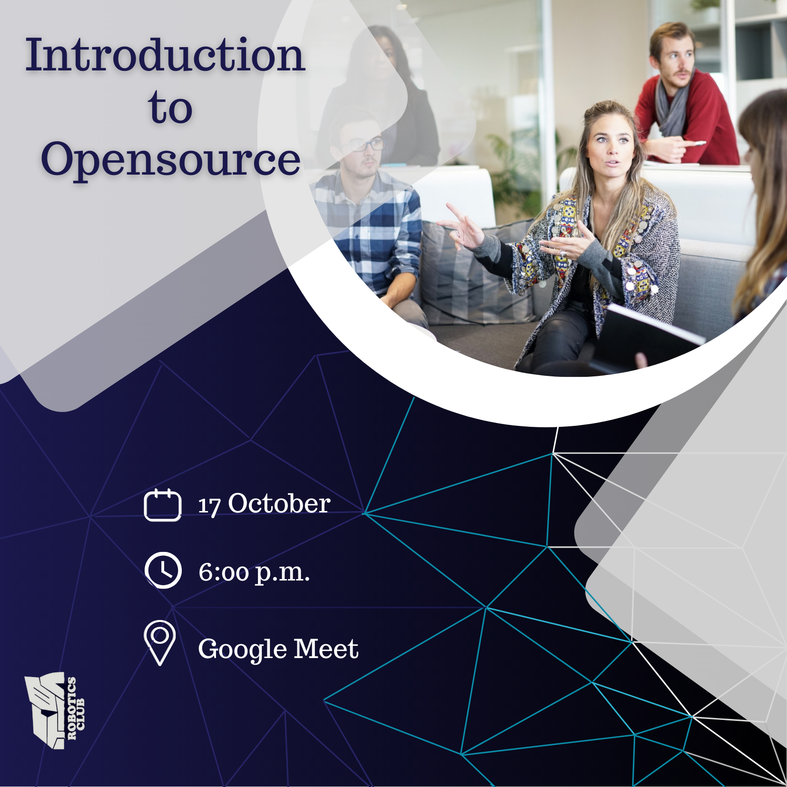

<h2><li>Introduction to open source – 17th October, 6pm</h2>

<h1>Agenda of Day 1</h1>
<h3>The question starts: what is open source? Open source is a free software for your business or personal use. Now comes the culture of it. Open-source culture is quite the buzz word as Open-source developers freely share their knowledge and make the source code available to the public. This grants access to modify the source code for betterment.
The Intention of RWOC initiative is for the very inculcating of open-source culture.
 </h3>

 
 

# Event Poster

# Recording

`The Event` : 
Those who want to revise or have missed some part in the workshop can refer to the recording click [here](https://drive.google.com/file/d/1tupuHXuur9KwDQNHshVKtapsjdVWOrVy/view?usp=sharing)