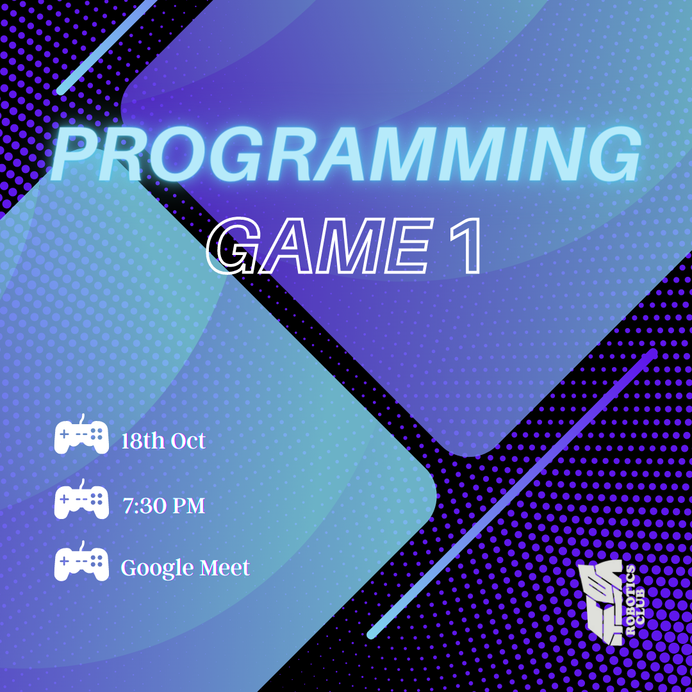

<h2><li>Programming Games: 18th October, 7.30 pm</h2>

<h1>Agenda of Day 2</h1>
<h3>We agree, learning things by doing projects is a great idea. But, how about learning it in a fun way? 
Fun way?!! Yeah, you read it correctly. Today, we are organizing programming games for all of you. Learning through games is definitely a better way to learn, I guess.
 </h3>

 
 

# Event Poster

# Recording

`The Event` : 
Those who want to revise or have missed some part in the workshop can refer to the recording click [here](https://drive.google.com/file/d/1QbI3P8wDpGt6phbKtW0332ozt4AzLFiF/view?usp=sharing)