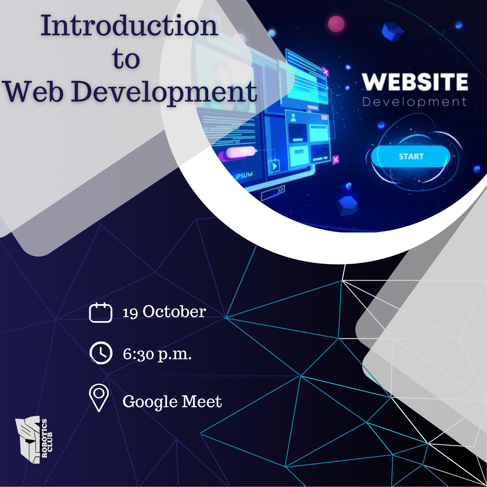

<h2><li>Intro to web development: 19th October, 6.30 pm</h2>

<h1>Agenda of Day 3</h1>
<h3>Website development!! A fun yet vast domain. Websites range from simple single page to sort of complex multi-page ones, and the thing here is we need a huge tech stack to build functional websites coupled with various frameworks and great UI/UX design.
Worry not the charm here is the basic stuff are the same all around. These Include the big three HTML, CSS and JavaScript.
This session will be an interactive one and we will cover up all the stuff that is needed to kickstart your webdev journey.
On endnote HTML→ nah! skeleton; CSS → wow! magic; JAVASCRIPT → action! Jackson;
In order to make the session more interactive, we planned to have a small quiz at the end... 
We know you will definitely have a question... What is the benefit in participating the quiz? 
Top 5 scorers in the quiz will get a chance to be mentored by the speaker... 
I hope this answered your question... 

 </h3>

 
 

# Event Poster

# Recording

`The Event` : 
Those who want to revise or have missed some part in the workshop can refer to the recording click [here](https://drive.google.com/file/d/1bHxKC_I3l_vAOwnXceiIcOZ6rXtPegIy/view?usp=sharing)

# Presentation

Hava a look [here](https://www.canva.com/design/DAEs0TQ-KvY/gn1PvwLLcoXWjkmkKsHzDA/view?utm_content=DAEs0TQ-KvY&utm_campaign=designshare&utm_medium=link&utm_source=sharebutton) for the ppt explaining Web development.